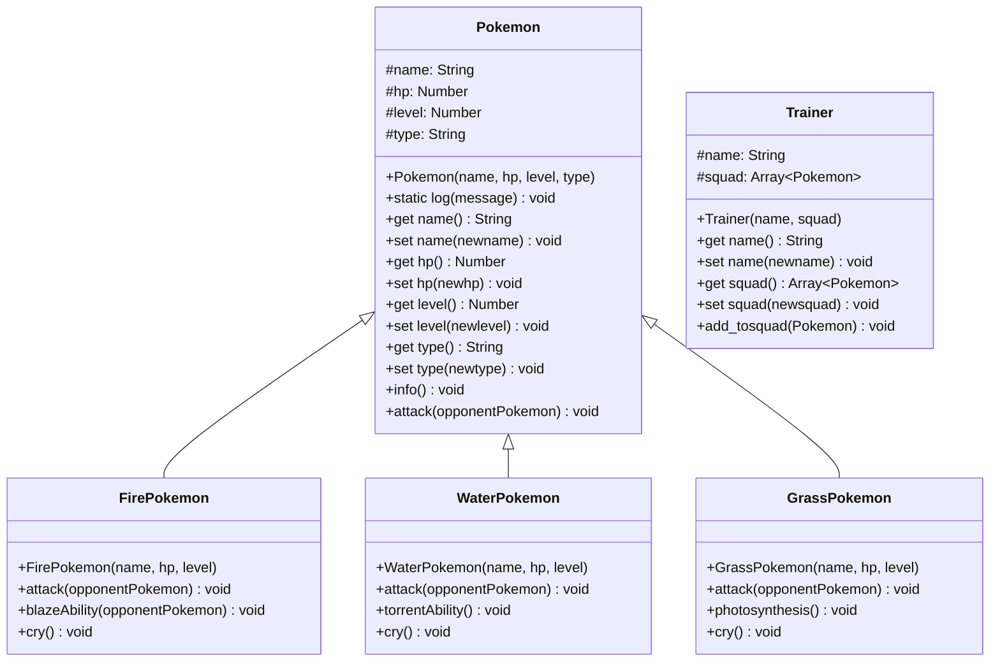

# Exercice 1 - Création d'un objet littéral
Créez un objet littéral représentant un "Livre" avec les propriétés suivantes :
- title (string)
- author (string)
- publicationYear(number)
- available (boolean)
Ajoutez également une méthode "logInfo" qui affiche dans la console les informations du livre sous la forme : "Le livre [title] écrit par [author] en [publicationYear] est [available ? "disponible" : "indisponible"]".

Créez deux livres différents et appelez leur méthode "logInfo".

## Exercice 2 - Constructeur d'objet et prototype
Créez un constructeur de "Voiture" (Car) qui prend en paramètres :
- brand (string)
- model (string)
- year (number)
- color (string)
Ajoutez une méthode "start" au prototype de Voiture qui affiche dans la console : "La [brand] [modele] démarre !".
Ajoutez une méthode "stop" au prototype de Voiture qui affiche dans la console : "La [brand] [modele] s'arrête.".
Créez deux instances de Voiture différentes, puis utilisez les méthodes start et stop sur chacune d'elles.

## Exercice 3 - Classes et héritage
Créez une classe "Animal" avec :
- Un constructeur qui prend en paramètre le "name" et "age" de l'animal
- Une méthode "introduceMySelf" qui affiche dans la console : "Je m'appelle [name] et j'ai [age] ans."
Ensuite, créez une classe "Cat" qui hérite de la classe "Animal" :
- Ajoutez une propriété "color" au constructeur
- Ajoutez une méthode "meow" qui affiche "Miaou !" dans la console
- Surchargez la méthode "introduceMySelf" pour qu'elle affiche d'abord le message de la classe parent, puis ajoute : "Je suis un chat de couleur [color]."
Créez deux instances de Chat avec des noms, âges et couleurs différents, puis appelez leurs méthodes introduceMySelf et meow.
# Exercice 4 - Pokémon Battle System
## Objectif
Créer un mini-système de combat Pokémon en JavaScript qui implémente les concepts d'héritage, d'encapsulation et de polymorphisme.
## Contexte
Dans le monde des Pokémon, différents types de créatures possèdent des caractéristiques et des capacités uniques. Ces Pokémon peuvent s'affronter dans des combats où leurs statistiques et leurs types déterminent l'issue du combat.
## Instructions
### Partie 1 : Classe de base et Encapsulation
1. Créez une classe de base `Pokemon` avec :
    - Des propriétés privées : `_name`, `_hp` (points de vie), `_level`, `_type`
    - Un constructeur qui initialise ces propriétés
    - Des getters pour accéder à ces propriétés
    - Des setters pour modifier ces propriétés avec validation (ex: les HP ne peuvent pas être négatifs)
    - Une méthode `info()` qui affiche les informations du Pokémon
    - Une méthode `attack(pokemon)` qui sera redéfinie dans les classes dérivées

### Partie 2 : Héritage
2. Créez trois classes dérivées de `Pokemon` :
    
    - `FirePokemon` (ex: Salamèche, Goupix...)
    - `WaterPokemon` (ex: Carapuce, Magicarpe...)
    - `GrassPokemon` (ex: Bulbizarre, Germignon...)
    - Chaque classe dérivée doit :
    
    - Appeler le constructeur parent
    - Définir le type automatiquement
    - Implémenter une capacité spéciale propre à son type :
        - Feu : `blazeAbility()` - augmente temporairement l'attaque quand les HP sont bas
        - Eau : `torrentAbility()` - augmente temporairement la défense quand les HP sont bas
        - Plante : `photosynthesis()` - récupère des HP au soleil
### Partie 3 : Polymorphisme
- Redéfinissez la méthode `attack(pokemon)` dans chaque classe dérivée avec un comportement différent selon le type :
    
    - Créez un système d'avantage/désavantage de type (Feu > Plante > Eau > Feu)
    - Si un Pokémon attaque un type contre lequel il est fort, les dégâts sont doublés
    - Si un Pokémon attaque un type contre lequel il est faible, les dégâts sont réduits de moitié
    - Ajoutez une méthode `cry()` dans chaque classe dérivée qui retourne un cri différent selon le type de Pokémon.
    
### Partie 4 : Classe Dresseur et Simulation de Combat
- Créez une classe `Trainer` qui :
    
    - Possède un nom et une équipe de Pokémon (tableau)
    - Peut ajouter des Pokémon à son équipe
    - Peut faire combattre ses Pokémon contre ceux d'un autre dresseur
    - Simulez un petit combat entre deux dresseurs où chacun choisit un Pokémon pour combattre. Le combat doit :
    
    - Alterner les attaques jusqu'à ce qu'un Pokémon soit K.O. (HP ≤ 0)
    - Appliquer les effets de type
    - Activer les capacités spéciales quand les HP sont bas (< 30%)
    - Annoncer le vainqueur du combat
## Bonus
- Ajoutez d'autres types de Pokémon (Electric, Psychic, etc.)
- Implémentez des attaques spécifiques pour chaque Pokémon
- Créez une interface utilisateur simple pour visualiser le combat
- Ajoutez des objets (items) que les Pokémon peuvent tenir pendant le combat
## Critère d'évaluation
- Utilisation correcte de l'encapsulation (propriétés privées, getters/setters)
- Implémentation de l'héritage (classes dérivées fonctionnelles)
- Utilisation du polymorphisme (redéfinition de méthodes)
- Respect de la thématique Pokémon
- Organisation et lisibilité du code
- Fonctionnalité du système de combat

- [ ] 